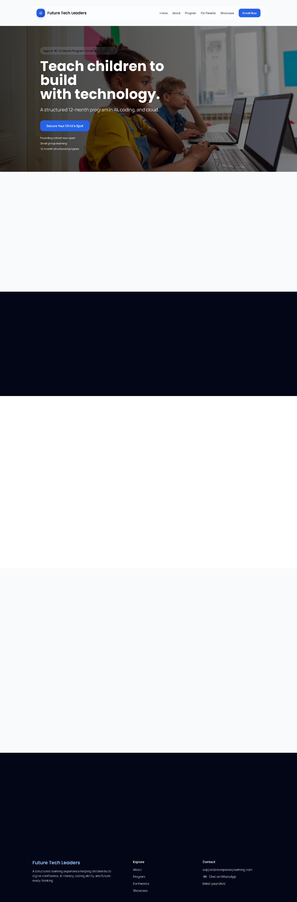

# Future Tech Leaders Docker Compose Deployment

## Overview

This project is a containerized deployment of the Future Tech Leaders website using Docker and Docker Compose. The application is a Next.js website that runs on Node.js and uses Supabase configuration through environment variables.

The goal was to inspect an existing application, understand its runtime requirements, build a Docker image, run it with Docker Compose, and validate that the deployment works.

## Technologies Used

- Docker
- Docker Compose
- Node.js
- Next.js
- React
- TypeScript
- Supabase
- Git and GitHub

## What I Did

- Identified the application as a Next.js/Node.js project by reviewing `package.json`.
- Reviewed the `Dockerfile` and `docker-compose.yml`.
- Built and started the application using Docker Compose.
- Verified the site in the browser at `http://localhost:3001`.
- Used `docker compose ps`, `docker compose logs`, and `curl` to validate the deployment.
- Fixed a production image optimization warning by adding the `sharp` dependency.
- Removed local environment files and build output from Git tracking.

## Screenshot



## How To Run Locally

Go into the application folder:

```bash
cd future-tech-leaders-website